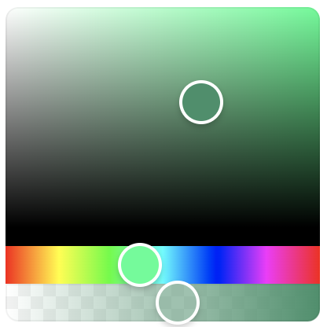

<div align="center">
  <a href="https://omgovich.github.io/react-colorful">
    
  </a>
</div>
<div align="center">
  <strong>vue-colorfull</strong> is a tiny color picker component for Vue apps.

Inspired by <a href="https://omgovich.github.io/react-colorful/">react-colorful</a>

</div>

## Getting Started

```
npm install vue-colorfull
or
pnpm add -D vue-colorfull
```

```js
import { ref } from "vue";
import { VueColorfull } from "vue-colorful";
import type { HsvaColor, HsvColor, HslColor, HslaColor, RgbColor, RgbaColor } from 'vue-colorfull'

const colorhex = ref<string>('00ddff')

...

<template>
    <VueColorfull v-model="colorhex"  type="hex"/>
</template>
```

## Types


| type         | value example                      |             |
| ------------ | ---------------------------------- | ----------- |
| `hex`        | `"#ffffff"`                        | `string`    |
| `hexa`       | `"#ffffff88"`                      | `string`    |
| `rgb`        | `{ r: 255, g: 255, b: 255 }`       | `RgbColor`  |
| `rgba`       | `{ r: 255, g: 255, b: 255, a: 1 }` | `RgbaColor` |
| `rgbString`  | `"rgb(255, 255, 255)"`             | `string`    |
| `rgbaString` | `"rgba(255, 255, 255, 1)"`         | `string`    |
| `hsl`        | `{ h: 0, s: 0, l: 100 }`           | `HslColor`  |
| `hsla`       | `{ h: 0, s: 0, l: 100, a: 1 }`     | `HslaColor` |
| `hslString`  | `"hsl(0, 0%, 100%)"`               | `string`    |
| `hslaSting`  | `"hsla(0, 0%, 100%, 1)"`           | `string`    |
| `hsv`        | `{ h: 0, s: 0, v: 100 }`           | `HsvColor`  |
| `hsva`       | `{ h: 0, s: 0, v: 100, a: 1 }`     | `HsvaColor` |
| `hsvString`  | `"hsv(0, 0%, 100%)"`               | `string`    |
| `hsvaSting`  | `"hsva(0, 0%, 100%, 1)"`           | `string`    |
